# Guide de déploiement : IA sur N6Cam OpenMV & Robot STeaMi

Ce document détaille la marche à suivre pour entraîner un modèle de détection de panneaux, l’embarquer sur une caméra N6Cam de chez OpenMV et piloter un robot EdgeAI STeaMi en fonction des détections. 

# Étape 1 : Conception de la base de données et entraînement du modèle.

## 1.1 Préparation du dataset

### 1.1.1 Installation du GTSRB

Afin de concevoir notre premier modèle, il est impératif d’avoir à notre disposition un dataset assez large et complet (qui contient des images nettes, proches, lointaines, altérées : de côté, dans le noir, floutées, etc.) afin de permettre à notre modèle par la suite d’avoir une meilleure précision. Pour cela, il a fallu chercher un dataset déjà bien connu et très fourni, le GTSRB (German traffic sign recognition benchmark) qu’il est possible de télécharger au lien suivant : https://www.kaggle.com/datasets/meowmeowmeowmeowmeow/gtsrb-german-traffic-sign 

Une fois le dataset téléchargé sous forme de zip, au nom ‘archive.zip’, décompresser le fichier et l’ouvrir pour en dévoiler l’intérieur :

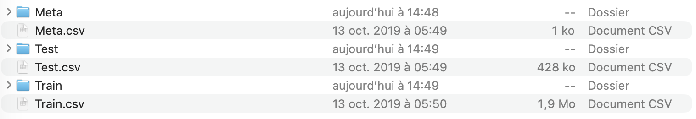

Dans le dossier “Meta” se trouvent les différents panneaux et leur numérotation dans cette database, par exemple le panneau numéroté 1 est celui de la signalisation d’une vitesse limitée à 30 km/h, le panneau stop est le numéro 14, etc. 

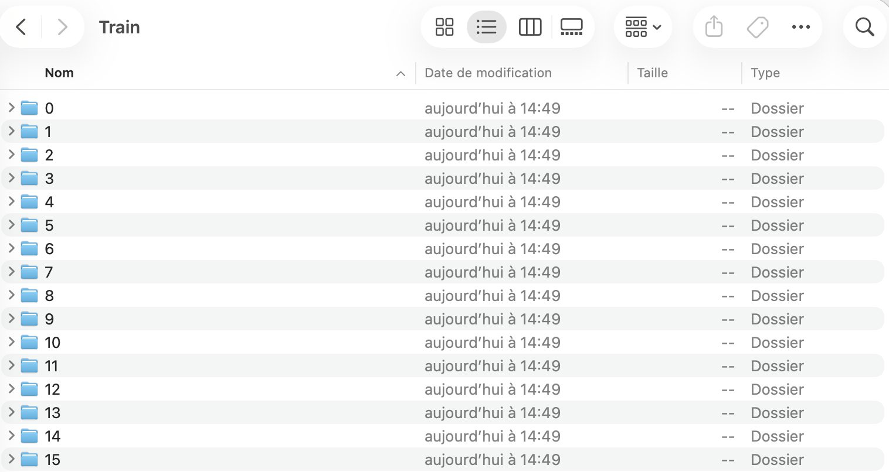

Le dossier « Train », quant à lui, contient toutes les images qui serviront à entrainer le modèle. Celles-ci sont rangées par id des panneaux (comme énoncé précédemment, le numéro 14 pour le panneau stop par exemple). C’est ce dossier qui va nous servir pour concevoir notre dataset et entraîner notre modèle. 

!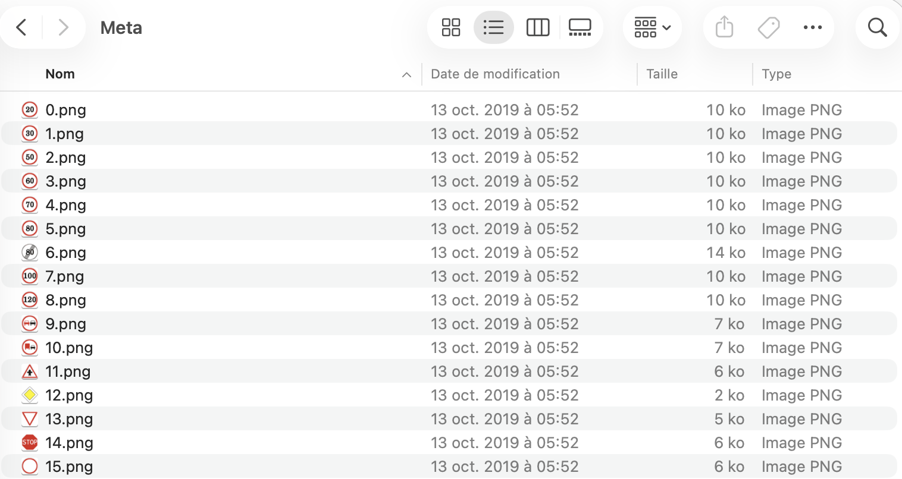

Enfin, le dossier ‘Test’ ne nous servira pas ici, mais il peut être utile dans d’autres contextes pour avoir un dataset pour la phase de test du modèle, pour tirer des conclusions sur son fonctionnement. 

### 1.1.2 Images situationnelles

Il est fortement conseillé de prendre des photos additionnelles dans le contexte exact où le robot évoluera. Imprimez les panneaux concernés, placez-les dans votre décor et prenez une cinquantaine de photos variées (de près, de loin, en penchant la caméra, sous différents éclairages, etc.). Cela empêchera le modèle d'être perturbé par l'arrière-plan de votre propre salle de test.

Quelques exemples ci-dessous (une photo sombre, une de près, une penchée) :

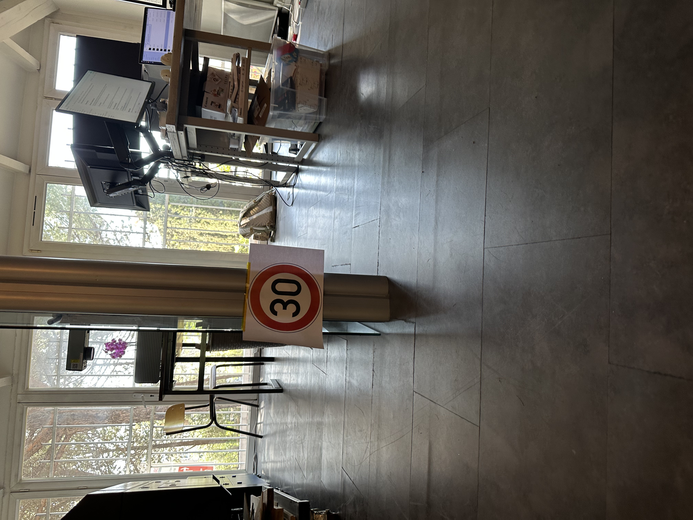

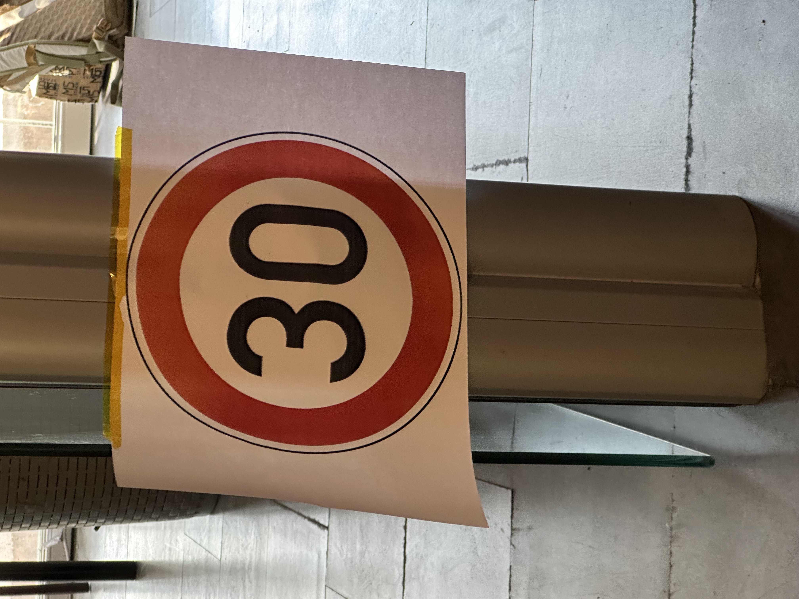

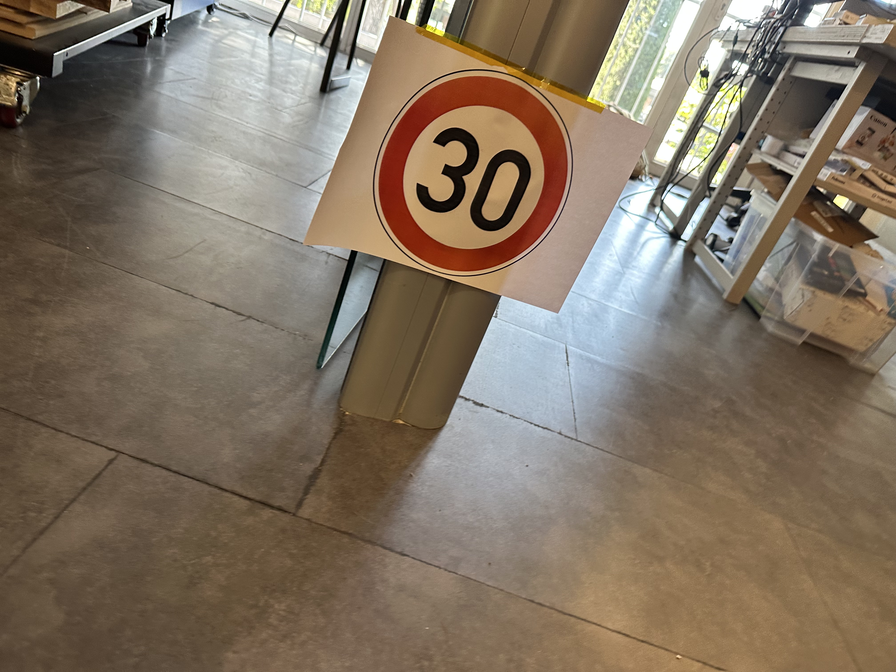

### 1.1.3 Préparation sur Roboflow

Après avoir créé un compte sur : https://roboflow.com/ Aller dans l’onglet dédié aux projets, puis cliquer sur new project (ou + Project).

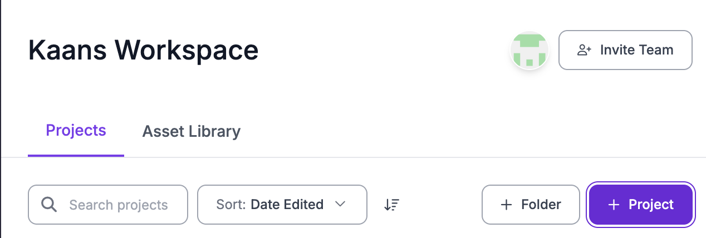

La page suivante s’ouvrira, dans laquelle, sous la partie “Project Type”, sélectionnez Object Detection, puis appuyez sur create public project. 

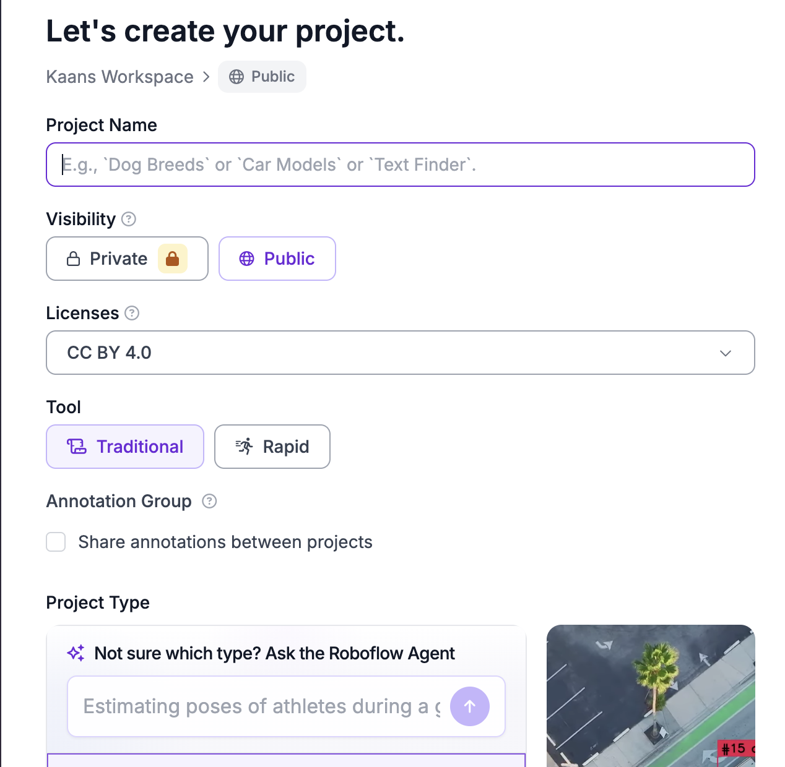

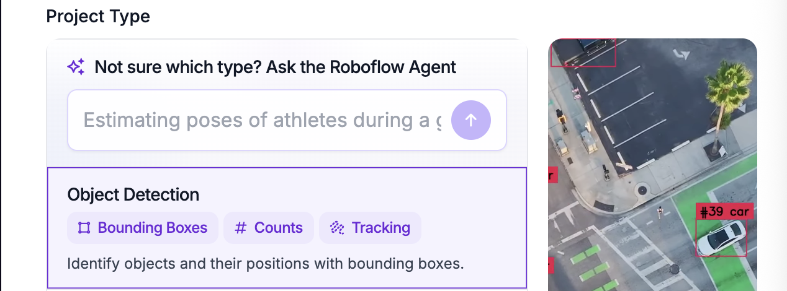

Importez toutes les images qui nous intéressent (environ 300 images du dataset GTSRB par type de panneau + vos images "faites maison"), puis cliquez sur **Save and continue**. À la question *How do you want to label your images*, sélectionnez **Label Myself**. (L'option d'auto-étiquetage existe, mais l'annotation manuelle reste la plus fiable pour démarrer). Sur la page suivante, il faudra donc annoter à la main chacune des images, c’est-à-dire dessiner un carré autour du panneau, et indiquer sa classe. “Save” puis répéter pour chacun des panneaux.

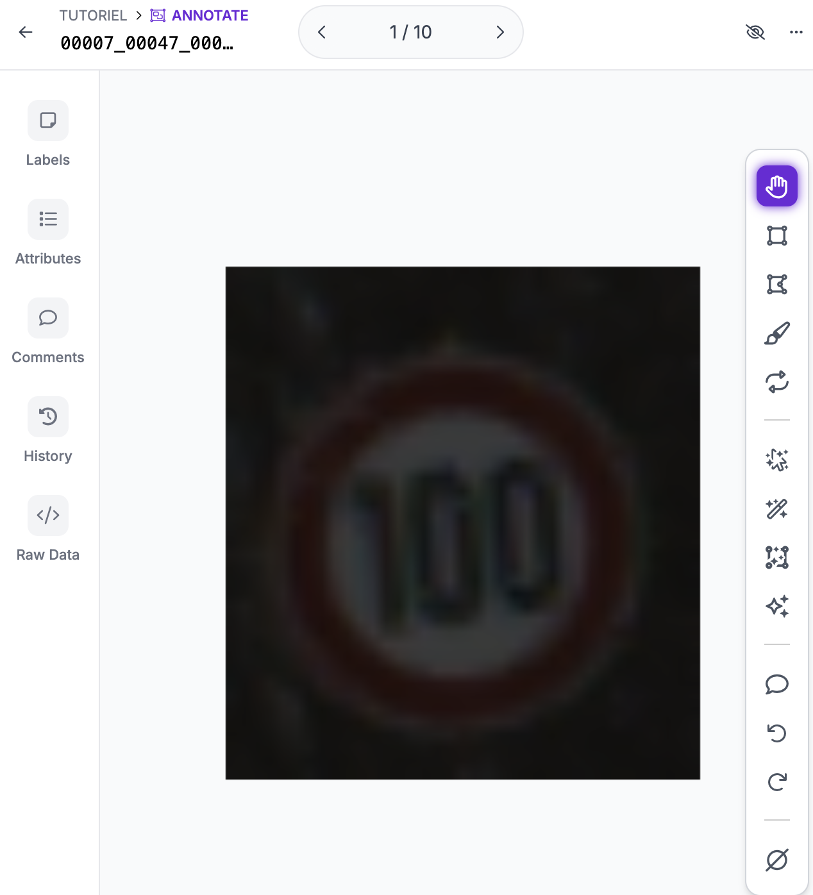

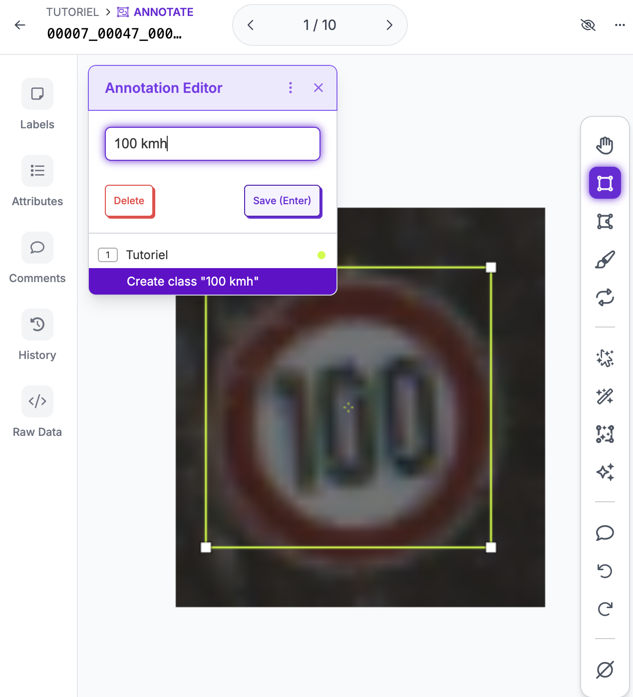

Cliquez ensuite sur **Download Dataset**, sélectionnez le format **YOLOv8** et choisissez l'option **Show download code**. Copiez ce code de téléchargement, nous en aurons besoin pour l'étape suivante.

## 1.2 Création et entraînement du modèle

L'entraînement du modèle se fait sur Google Colab pour profiter de la puissance des cartes graphiques (GPU) gratuites.

**Lien vers le Notebook Colab :**   https://colab.research.google.com/drive/1T4Z67SbC2c2ox-Oe9yR01T0YQhgN-zBn?usp=sharing

### 1.2.1 Comment apprend notre modèle YOLOv8 ? (You Only Look Once)

Il est facile de percevoir l'intelligence artificielle comme une "boîte noire magique". En réalité, le code Python de notre notebook suit une logique d'apprentissage très structurée.

#### 1. Les fondations : les bibliothèques clés :

Notre script repose principalement sur deux outils : 

→ La bibliothèque Ultralytics (YOLO), qui est le moteur principal de notre modèle, contient toute l’architecture complexe du réseau de neurones YOLOv8, ce qui nous évite donc de devoir recoder le modèle à la main. 
→ La bibliothèque PyTorch de calcul matriciel sur laquelle YOLO est construit, qui nous sert principalement à modifier certaines étapes du processus. 

#### 2. Le transfer Learning : Ne pas partir de zéro

Entraîner une IA à partir de rien nécessiterait des millions d’images et des semaines de calcul pour avoir de bons résultats. Pour contourner cela, notre code effectue deux actions. Dans un premier temps, il charge le “plan de construction” d’un modèle ultra-léger via YOLO(’yolov8n.yaml) (yolov8n comme “nano” en référence à la taille du modèle, adapté à l’embarqué). Et puis on y injecte des connaissances préalables en téléchargeant un modèle déjà entraîné sur des millions d’images (via model.load). Grâce à cela, il sait déjà reconnaître des formes, des contrastes, des bords et notre but sera donc simplement d’orienter cette connaissance existante vers nos panneaux de signalisation. 

#### 3. Le lancement de l’entraînement

L'apprentissage se lance via la commande model.train(…), il est défini par plusieurs paramètres :

→ epochs = 100 : Le modèle va examiner l’intégralité de notre dataset 100 fois de suite. 
→ imgsz = 192 : les images sont dimensionnées en 192x192 pixels avant d’être analysées.
→ batch = 16 : L’IA n’apprend pas image par image, mais par “parquets” de 16 pour accélérer le calcul. 

#### 4. Analyser les résultats :

Une fois les 100 époques terminées, le code génère automatiquement plusieurs graphiques pour nous prouver que le modèle a bien compris sa tâche. 

**Les courbes d'apprentissage (Loss & mAP) :** Le script affiche un graphique d'évolution (`results.png`). La courbe "Loss" (les erreurs) doit descendre, tandis que la courbe "mAP" (la précision) doit monter.

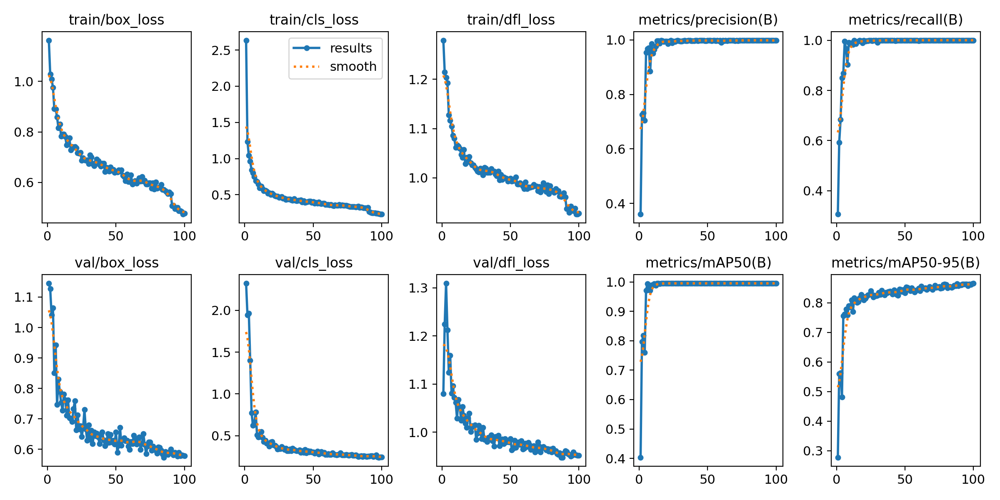

**La Matrice de Confusion :** Générée via `confusion_matrix.png`, cette grille permet de voir exactement où le modèle hésite

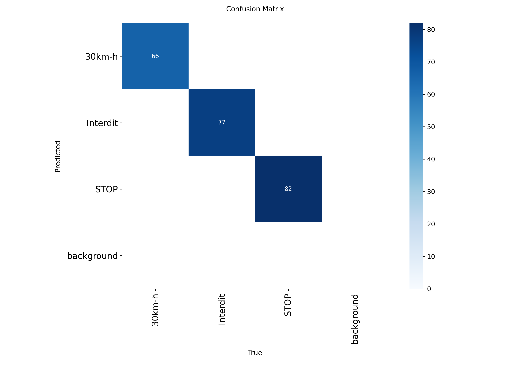

**Validation visuelle directe :** Le notebook trace ses propres prédictions (`val_batch0_pred.jpg`) sur un échantillon d'images pour nous montrer les *Bounding Boxes* et les pourcentages de confiance générés.

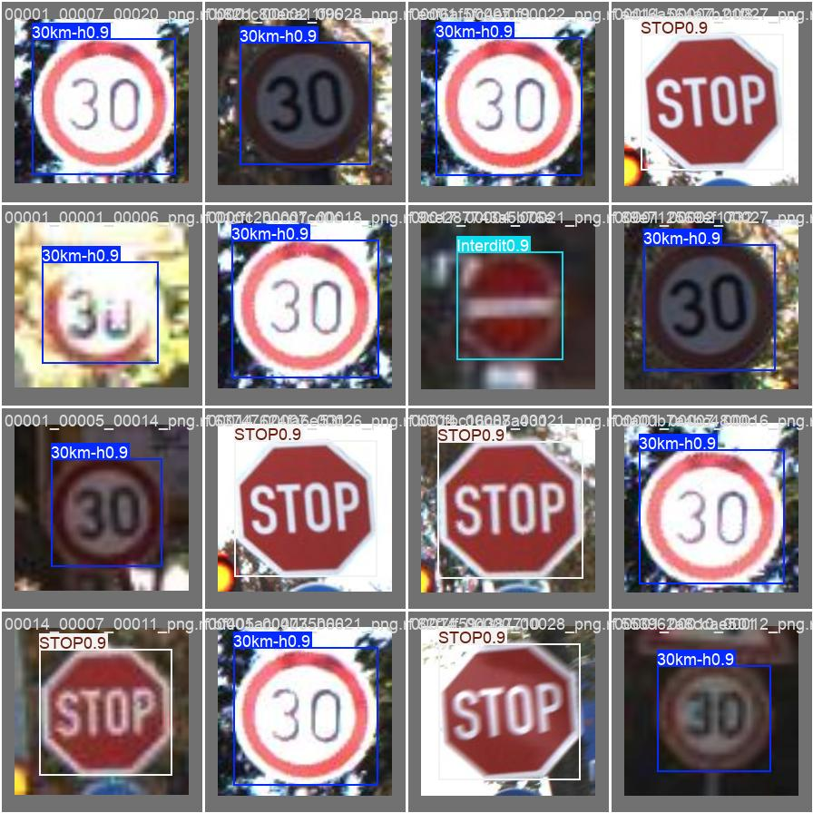

### 1.2.2 Spécifications liées à la N6Cam

Maintenant que nous comprenons le fonctionnement général, il faut savoir que ce Notebook n'est pas un entraînement YOLO standard. Des optimisations matérielles profondes y ont été codées pour éviter les crashs de la caméra[ :

Tout au long du projet, au fil des conceptions des modèles et des tests il a été découvert que la N6Cam gérait mal certaines fonctions mathématiques natives au YOLOv8 telles que SiLU ou encore depthToSpace, qui nécessitent alors d’être déléguées au CPU, ce qui provoquait des goulots d’étranglement qui faisaient crash le processus, ou donnaient de très mauvaises performances (1 à 2 fps). Il a donc fallut écraser cette fonction SiLU en passant par une fonction ReLU plus classique que le N6 sait gérer parfaitement. De plus l'entraînement est bridé à une taille d'image de `imgsz=192`. Cela correspond exactement à la fenêtre matérielle que la caméra capture, permettant de garder des FPS élevés tout en économisant la RAM. Enfin, la Quantification Hybride : Le modèle est converti en format TensorFlow Lite (`.tflite`). Pour dialoguer parfaitement avec l'écosystème OpenMV, le code force les *entrées* du modèle en nombres entiers (`tf.int8`) pour exploiter la vitesse pure du NPU, et les *sorties* en nombres à virgule (`tf.float32`) pour que la caméra puisse afficher les boîtes de détection sans crasher.

### 1.2.3 Comment utiliser le notebook ?
ATTENTION, À CAUSE DES MISE À JOUR RÉCURRENTES DE GOOGLE COLAB LE NOTEBOOK POURRAIT NE PLUS FONCTIONNER AU MOMENT DE L'UTILISATION DE CELUI-CI.

Même si ce code effectue des opérations complexes, il est conçu pour être utilisé de manière presque automatique.

**Activation de l'accélérateur graphique (indispensable) :** Par défaut, Colab utilise un processeur standard (CPU). Si vous lancez l'entraînement ainsi, cela sera atrocement lent et le processus risque de ne jamais aboutir (ou de prendre des heures). Avant toute chose, allez dans le menu supérieur : **Exécution** > **Modifier le type d'exécution**. Sous "Accélérateur matériel", choisissez **T4 GPU** (ou **GPU**), puis enregistrez.

**Installation des bibliothèques :** Exécutez la toute première cellule de code (celle qui contient `!pip install...`). *Note importante :* Il arrive fréquemment que Colab ait besoin de redémarrer son environnement pour bien prendre en compte les nouvelles installations. Si un bouton "Restart session" (Redémarrer la session) apparaît à la fin de l'installation, cliquez dessus. Ensuite, **relancez cette même première cellule** pour vous assurer que tout est parfaitement chargé.

**Connexion du dataset :** Dans la cellule suivante, remplacez les informations de la variable `rf = Roboflow(api_key="...")` par le bout de code de téléchargement que Roboflow vous a donné à l'étape 1.2. 

**Exécution complète :** Allez dans le menu supérieur et cliquez sur **Exécution** > **Tout exécuter**. L'entraînement prendra environ une dizaine/vingtaine de minutes selon la taille de votre dataset. À la fin de l'exécution, un fichier unique nommé `network_hybride.tflite` va se générer et se télécharger automatiquement sur votre ordinateur. **C'est le seul et unique fichier dont vous avez besoin pour la suite du projet. (revérifier que ça s’installe bien automatiquement sinon dire que normalement en lisant les alertes dans le terminal on peut voir où est le fichier à récupérer)**

# Étape 2 : Flashage du modèle dans la caméra N6Cam

Une fois le modèle entraîné, il faut l'importer dans la caméra. Cette étape est critique : une mauvaise méthode d'importation fera irrémédiablement planter la caméra.

## 2.1 Pourquoi ne faut-il PAS passer par la carte SD

Il est tentant de simplement glisser le fichier. tflite sur une carte SD. Cependant, cela provoque un **RAM Overflow** (dépassement de la mémoire vive). La carte SD étant trop lente pour être lue en temps réel, le microcontrôleur est forcé de copier l'intégralité du modèle (plusieurs Mo) dans sa RAM avant de s'en servir. La RAM doit alors stocker simultanément le modèle, l'image vidéo haute résolution et la zone de calcul. Le système sature et crashe instantanément.

## 2.2 La solution : La mémoire ROMFS (Flash interne)

La solution consiste à utiliser la mémoire morte de la caméra (ROMFS) et la technologie **XIP** (*eXecute In Place*). En gravant le modèle dans cette mémoire Flash, l'accélérateur matériel (NPU) de la N6Cam peut lire les millions de paramètres mathématiques directement depuis le stockage interne à très haute vitesse, sans jamais les copier dans la RAM. L'occupation du modèle dans la RAM tombe à 0 Mo, permettant d'atteindre plus de 40 FPS de manière ultra-stable

### 2.2.1 Comment faire cela ?

(cette étape peut nécessiter d'installer ST EDGE AI 4.0.0)
→ Installez OpenMV IDE https://openmv.io/pages/download puis lancez l’application. (Ce tutoriel a été conçu sous OpenMV IDE 4.8.11)
→ Commencez par vous assurer que la caméra est à jour en la branchant via le câble USB et en allant dans Outils > Installer la dernière version de développement.
→ Une fois cela fait, allez dans Outils > Système de fichier ROM > Modifier les romfs sur une came OpenMV.
→ Une fenêtre s’ouvre : cliquez sur Ajouter un fichier (deuxième bouton en partant de la gauche en bas de la page) et sélectionnez le fichier network_hybride.tflite de l'étape 1 (vous remarquez que se trouve sur cette page tous les modèles exemples crées par l’entreprise). Pour l'optimisation, séléctionnez "Optimisation moyenne" et validez. Si vous avez récupéré le fichier "network_hybride.tflite" de ce repo, choisissez "Aucune optimisation". 
→ Enfin, cliquez sur “Commettre” (ou Commit le bouton bleu), une page s'ouvre laissez commettre un fichier sur une came OpenMV et validez. C’est cette action qui grave physiquement le modèle dans la mémoire Flash de la caméra. 

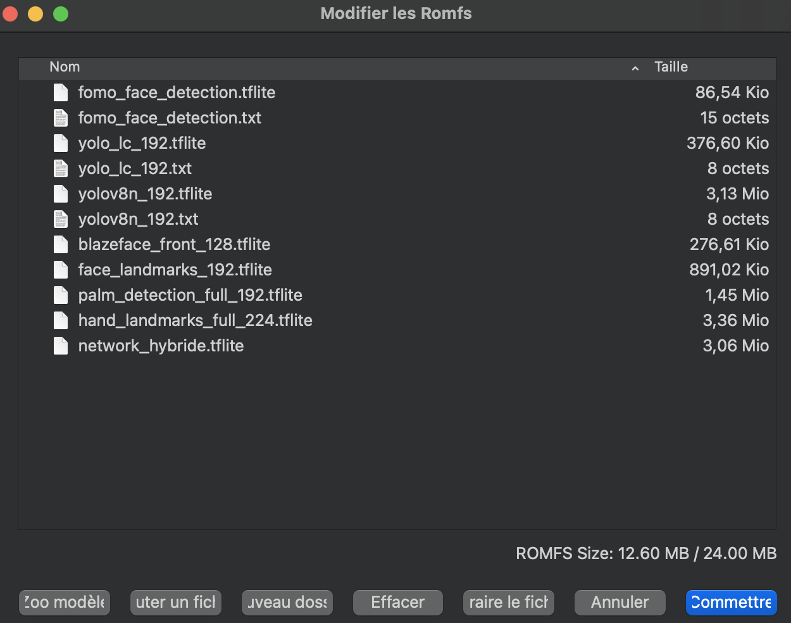

# Étape 3 : Programmation et test de la caméra (MicroPython)

Maintenant que le modèle est gravé dans la mémoire de la caméra, nous devons écrire le script qui va l'exploiter. Ce code en MicroPython va capturer les images, les envoyer au modèle, dessiner les résultats à l'écran et préparer l'ordre final qui sera envoyé au robot.

## 3.1 Décryptage du code : comment la caméra voit-elle ?

Pour ne pas faire de ce script une simple “boîte noire”, voici les trois mécanismes clés qui le composent :

### 3.1.1 L’optimisation matérielle du flux vidéo

La caméra est configurée dans le code qui vient nativement avec le logiciel OpenMV IDE, grâce à ces deux commandes :

cam.pixformat(csi.RGB565), qui instaure le format de couleur de 16 bits par pixel, et cam.window((192,192)), qui applique un recadrage matériel au centre de l’image. Cette opération est cruciale car notre modèle YOLOv8 a été entraîné spécifiquement sur des images de 192x192 pixels. 

### 3.1.2 Le blindage anti-crash ou “parsing”

Notre modèle d’IA renvoie ses résultats sous la forme de matrices (des listes de nombres imbriquées). Parfois, ces formats varient et font planter les scripts. C’est pourquoi dans ce code nous avons conçu une fonction **extraire_multiclasse(predictions)** qui agit ici comme un bouclier : elle lit les données renvoyées par l’IA pour extraire uniquement les données (x, y, largeur, hauteur), le score de confiance et l’ID de la classe, en ignorant tout composant anormal qui pourrait causer un crash. 

### 3.1.3 La logique de décision (choix du meilleur candidat)

La caméra peut voir plusieurs panneaux en même temps. S’il y a un vrai panneau “STOP” au premier plan (sûr à 90 %), et un panneau un peu plus loin, qui n’est sûr qu’à 80 %, la caméra ne doit pas envoyer deux ordres contradictoires au robot. La boucle principale compare les scores et ne retient que le meilleur candidat à chaque image avant d’attribuer la lettre correspondante (V pour 30 km/h, I pour Interdit, S pour STOP).

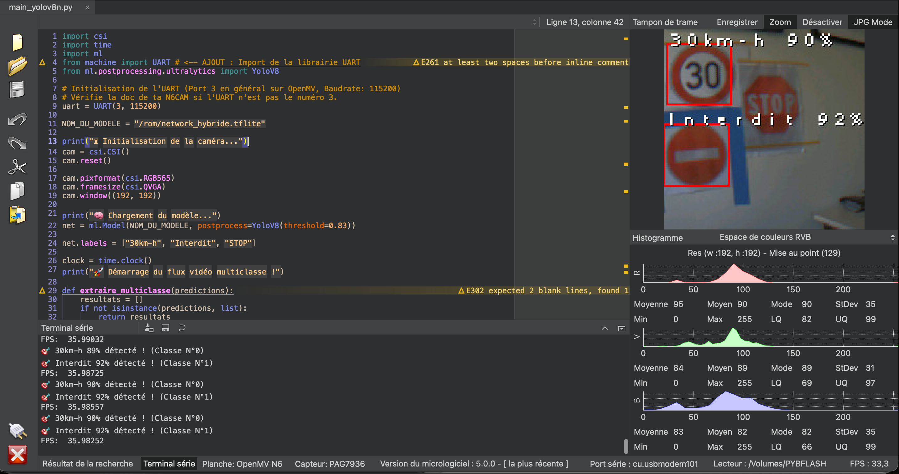

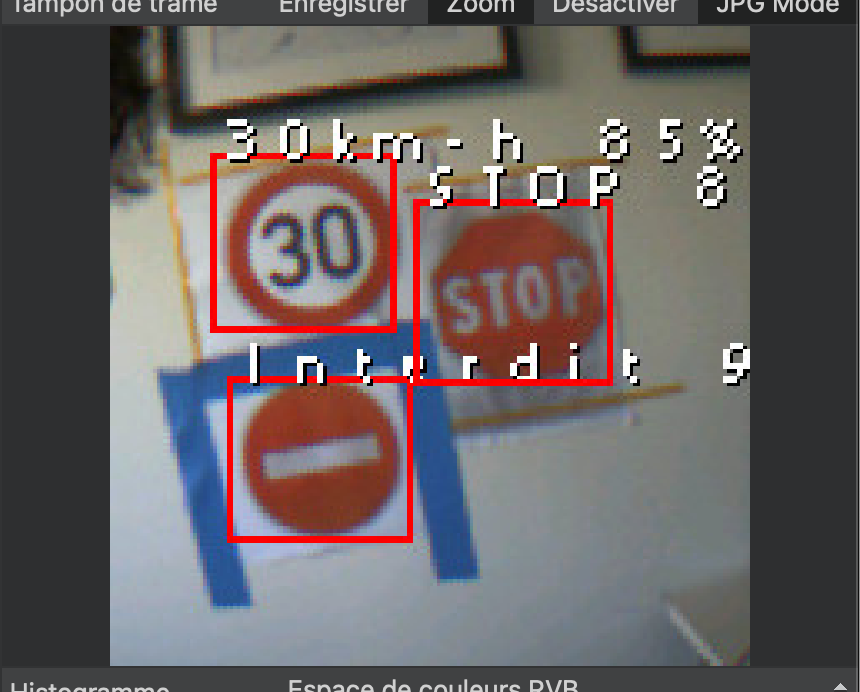

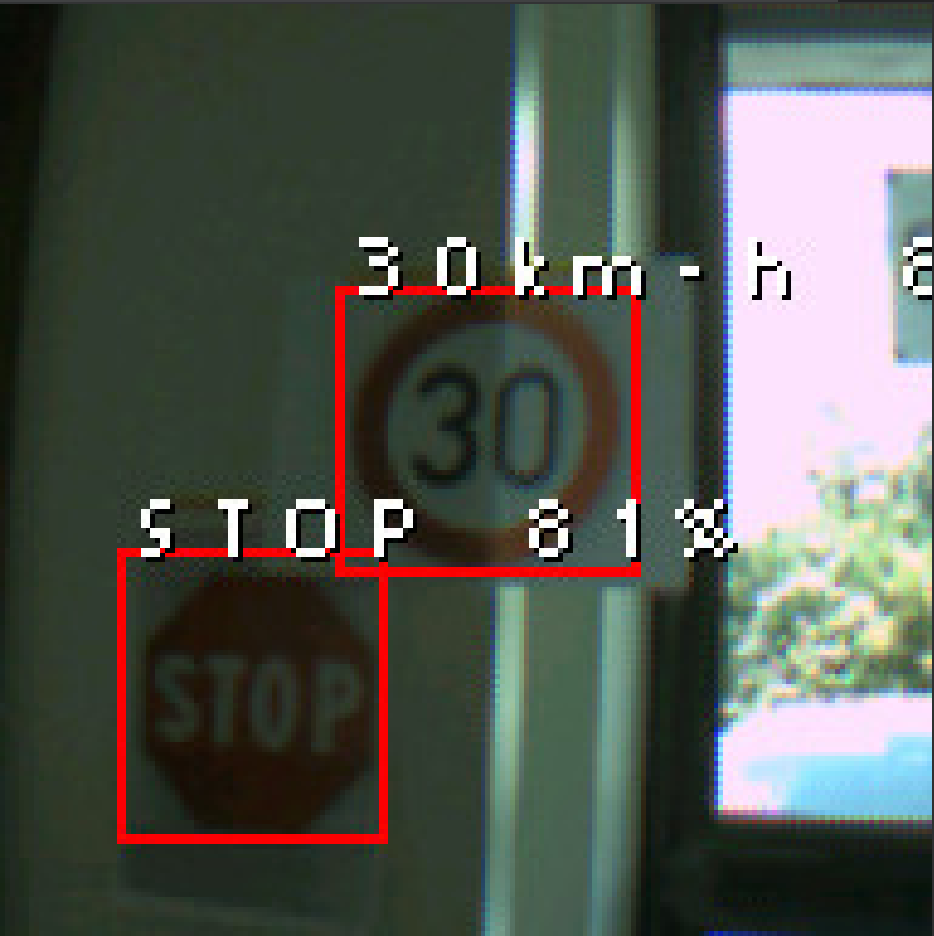

## 3.2 Le script complet à embarquer

Vous pouvez copier-coller ce code directement dans OpenMV IDE. Une fois le code lancé, vous verrez le flux vidéo avec les Bouding Boxes et les pourcentages s’afficher en direct sur votre ordinateur. 

```python
import csi
import time
import ml
from machine import UART # Import de la librairie UART
from ml.postprocessing.ultralytics import YoloV8

# Initialisation de l'UART (Port 3 en général sur OpenMV, Baudrate: 115200)
# Vérifie la doc de ta N6CAM si l'UART n'est pas le numéro 3.
uart = UART(3, 115200)

NOM_DU_MODELE = "/rom/network_hybride.tflite"

print("⏳ Initialisation de la caméra...")
cam = csi.CSI()
cam.reset()

cam.pixformat(csi.RGB565)
cam.framesize(csi.QVGA)
cam.window((192, 192))

print("🧠 Chargement du modèle...")
net = ml.Model(NOM_DU_MODELE, postprocess=YoloV8(threshold=0.83))

net.labels = ["30km-h", "Interdit", "STOP"]

clock = time.clock()
print("🚀 Démarrage du flux vidéo multiclasse !")

def extraire_multiclasse(predictions):
    resultats = []
    if not isinstance(predictions, list):
        return resultats

    if len(predictions) == 1 and isinstance(predictions[0], list) and not (len(predictions[0]) > 0 and isinstance(predictions[0][0], tuple)):
        dossiers = predictions[0]
    else:
        dossiers = predictions

    for class_id, dossier in enumerate(dossiers):
        if isinstance(dossier, list):
            for obj in dossier:
                if isinstance(obj, tuple) and len(obj) >= 2:
                    rect = obj[0]
                    score = obj[1]
                    resultats.append((rect, score, class_id))
    return resultats

while True:
    clock.tick()
    img = cam.snapshot()

    predictions = net.predict([img])
    detections = extraire_multiclasse(predictions)

    # Variables pour l'envoi UART
    meilleur_score = 0
    ordre_a_envoyer = "N" # 'N' pour Rien par défaut

    for rect, score, class_id in detections:
        try:
            x, y, w, h = int(rect[0]), int(rect[1]), int(rect[2]), int(rect[3])
            img.draw_rectangle((x, y, w, h), color=(255, 0, 0), thickness=2)

            nom_classe = net.labels[class_id] if class_id < len(net.labels) else f"Classe {class_id}"
            pourcentage = int(score * 100)
            label = f"{nom_classe} {pourcentage}%"

            # Trace dans le terminal
            print(f"🎯 {label} détecté ! (Classe N°{class_id})")

            # Texte sur la vidéo
            text_y = max(0, y - 15)
            img.draw_string((x + 1, text_y + 1), label, color=(0, 0, 0), scale=2)
            img.draw_string((x, text_y), label, color=(255, 255, 255), scale=2)

            # Sélection du panneau avec la meilleure confiance ---
            if score > meilleur_score:
                meilleur_score = score
                if class_id == 0:   # 30km-h
                    ordre_a_envoyer = "V"
                elif class_id == 1: # Interdit
                    ordre_a_envoyer = "I"
                elif class_id == 2: # STOP
                    ordre_a_envoyer = "S"

        except Exception as e:
            print("Erreur de dessin :", e)

    # --- Envoi de l'ordre via UART ---
    # Le "\n" est vital ! Il indique à la STeaMi que le message est terminé.
    uart.write(ordre_a_envoyer + "\n")

    print("FPS: ", clock.fps())

```

# Étape 4 : Câble matériel (communication Jacdac)

Maintenant que la caméra et son modèle sont fonctionnels, il faut parvenir à la relier au robot afin de le piloter, nous utilisons pour cela une liaison UART.

## 4.1 Pourquoi utiliser le port Jacdac ?

Pour ce projet, il a été décidé d’utiliser le port Jacdac pour suivre les contraintes matérielles de la STeaMi. La carte possède plusieurs ports UART, mais la plupart sont inutilisables pour notre application. L’UART principal, par exemple, est physiquement soudé au port USB de la carte, ce qui risquerait de créer un signal fantôme qui perturberait totalement la communication entre la caméra et le robot. Le port Jacdac, quant à lui, est librement accessible et utilisable. Bien qu’il soit nativement conçu pour des communications en single wire en half-duplex, ses broches physiques (PB6 et PB7) sont reliées à un véritable UART matériel. C’est donc ce port que nous allons utiliser pour y brancher notre caméra. 

## 4.2 Anatomie du câble et branchement du Jacdac

Le connecteur Jacdac est réversible et possède 3 fils :

GND : la masse (0 V)
DATA : le fil de transmission des données (3,3 V)
VCC : l’alimentation (5 V)

Il est impératif de se munir d’un multimètre pour vérifier l’ordre des câbles, le milieu est toujours la masse, tandis que les autres câbles sont soit la DATA soit le VCC, dépendamment de l’ordre de branchement (et du câble, j’ai l’impression). Il faut bien faire attention à ne pas brancher, ou toucher les endroits qui ne doivent pas l’être avec le câble 5 V pour ne pas endommager la caméra.

**Côté caméra (émetteur) :**
• Reliez le fil **DATA** du Jacdac à la broche **P4-TX** de la N6Cam.  
• Reliez le fil **GND** du Jacdac à la broche **GND** de la caméra.  

**Côté robot (récepteur) :**
• Branchez simplement le connecteur Jacdac sur le port dédié de la carte STeaMi. Sur la carte, ce port est physiquement relié aux broches `PB6` et `PB7` du microcontrôleur. 

# Étape 5 : Le code du robot STeaMi (C++/Arduino IDE)

Maintenant que la caméra et son code ont été configurés, et que celle-ci est connectée au robot via la STeaMi, il faut la programmer pour qu’elle puisse réagir en conséquence.

## 5.1 Le “hack” du protocole Jacdac

Le protocole Jacdac est nativement un bus *Half-Duplex Single Wire* (un protocole complexe de gestion de collisions réseau sur un seul fil). Il est normalement incompatible avec une simple communication UART.
L'astuce logicielle consiste à utiliser la fonction JacdacSerial.setHalfDuplex(). Cette commande désactive le protocole propriétaire et force le microcontrôleur du robot à utiliser ce fil uniquement pour "écouter" (RX) de manière passive les caractères envoyés par la caméra.

## 5.2 L’intégration du code du robot

Voici l’extrait de code à intégrer dans le programme principal du robot. *(le code entier est fourni en annexe)*

Au tout début du code, dans les includes : 

```arduino
HardwareSerial JacdacSerial(PB7, PB6); //déclaration du serial jacdac avec la commande hardwareSerial qui le permet
```

 Dans le void setup, ajoutez la ligne suivante :

```arduino
JacdacSerial.setHalfDuplex(); 
JacdacSerial.begin(115200);
```

Dans le void loop(), ajouter gestion_IA() de sorte à avoir :

```arduino
void loop() {
  menu();
  gestion_IA();
}
```

À la toute fin du code, ajouter la fonction de gestion de l’IA :

```arduino
//------------------- début de la fonction gestion IA : -----------------

void gestion_IA() {
  // 0. Sécurité anti-crash : Si le robot tape un mur (bumper), on bloque tout
  // même si la caméra dit d'avancer.
  if (flagBMP) {
    stop();
    return; 
  }

  // On écoute le câble relié à la caméra OpenMV
  if (JacdacSerial.available()) {
    
    // On lit la prédiction envoyée par MicroPython (la cam openMV)
    String message = JacdacSerial.readStringUntil('\n');
    message.trim(); 
    
    // Si on a bien reçu quelque chose
    if (message.length() > 0) {
      
      // 1. On éteint les LEDs par défaut avant d'appliquer le nouvel ordre
      digitalWrite(LEDR, LOW);
      digitalWrite(LEDG, LOW);
      digitalWrite(LEDB, LOW);
      strip.clear(); 
      
      // 2. LOGIQUE D'ACTION (MOTEURS + LUMIÈRES)
      if (message == "S") {
        // --- PANNEAU STOP ---
        stop();                               // Le robot s'arrête net
        digitalWrite(LEDR, HIGH);             // LED STeaMi Rouge
        strip.fill(strip.Color(150, 0, 0));   // Bandeau Robot Rouge
      } 
      else if (message == "V") {
        // --- PANNEAU 30 KM/H ---
        avant(120);                           // Le robot avance (Vitesse modérée 120 sur 255)
        digitalWrite(LEDG, HIGH);             // LED STeaMi Verte
        strip.fill(strip.Color(0, 150, 0));   // Bandeau Robot Vert
      } 
      else if (message == "I") {
        // --- PANNEAU SENS INTERDIT ---
        arriere(120);                         // Le robot recule 
        digitalWrite(LEDB, HIGH);             // LED STeaMi Bleue
        strip.fill(strip.Color(0, 0, 150));   // Bandeau Robot Bleu
      }
      else if (message == "N") {
        // --- AUCUN PANNEAU (Mode Normal) ---
        avant(150);                           // Le robot roule à sa vitesse de croisière (150)
        // Les LEDs restent éteintes.
      }

      // 3. On affiche la lumière
      strip.show();
    }
  }
}
//------------------- fin de la fonction gestion IA : -----------------
```

## 5.3 Intégration globale au robot 4x4 et comportement final

Le code de pilotage que nous avons intégré plus haut n’est qu’une brique au sein du programme complet du robot 4x4. Pour rappel, ce robot pédagogique est richement équipé : 4 moteurs à courant continu avec codeurs, 6 capteurs de distance (TOF), un sonar, un module Bluetooth (BLE) et un bandeau de LED. 

Notre intelligence artificielle s’intègre harmonieusement dans le fonctionnement de ce robot.

La fonction gestion_IA() est appelée en continu dans la fonction loop() de la carte Arduino, travaillant en parallèle de la fonction menu() qui gère les autres capteurs du robot.

Le code intègre également un coupe-circuit prioritaire via les "bumpers" (les pare-chocs tactiles du robot). Si le robot heurte un obstacle, la variable `flagBMP` s'active et stoppe les moteurs. Cette sécurité matérielle supplante totalement la caméra : même si l'IA voit un panneau "30 km/h" et donne l'ordre d'avancer, le robot restera figé pour éviter un accident. De plus, l'action du robot ne se limite pas à ses moteurs. Les prédictions de l'IA pilotent directement le stick de 8 LEDs Neopixel placé sur la carrosserie. Cela offre un excellent retour visuel lors des ateliers : le bandeau s'illumine entièrement en rouge pour le Stop, en bleu pour le Sens Interdit, et en vert pour les 30 km/h.

**À noter – La latence matérielle :** Lors des essais empiriques en conditions réelles, vous constaterez une légère latence (de 1 à 2 secondes) entre le moment où la caméra détecte le panneau et le moment où le robot exécute physiquement l'action. C'est un comportement parfaitement normal. Ce léger délai est dû au temps de traitement cumulé (inférence de l'image par le réseau de neurones + envoi de la trame via le câble Jacdac + traitement de la boucle principale du robot). 

# Étape 6 : Aller plus loin, ajouter de nouveaux panneaux :

Le projet a été conçu pour être évolutif, si vous souhaitez que le robot plus de 3 panneaux, la procédure est simple.

## 6.1 : Côté entraînement :

Sur Roboflow comme sur Colab, rien n’est à changer ! Il suffit simplement d’importer de nouvelles images et de les annoter en créant de nouvelles classes sur Roboflow. Sur Colab, lancer le script avec un nouveau dataset qui contient plus panneaux et suffisant, il suffira simplement d’exporter le fichier network_hybride.tflite mis à jour. 

## 6.2 : Côté caméra (code MicroPython)

C’est ici que les modifications interviennent. Il faut indiquer au code les nouveaux noms à afficher, et quelle lettre envoyer au robot lorsqu’ils sont détectés. 

Dans un premier temps, il faudra mettre à jour la liste des labels. Il faut trouver la ligne net.labels au début du script et y ajouter les nouveaux panneaux, strictement dans le même ordre que celui défini par Roboflow. (Si vous êtes perdus, en installant le dataset sur votre ordinateur, vous trouverez un data.yaml qui contient l’ordre des panneaux). 

```python
# Avant (3 panneaux)
net.labels = ["30km-h", "Interdit", "STOP"]

# Après (Exemple avec 5 panneaux)
net.labels = ["30km-h", "Interdit", "STOP", "Droite", "Feu-Rouge"]
```

Une fois cela fait, il faut assigner une nouvelle lettre comme dit précédemment : 

Dans la boucle principale du code, dans la zone commentée “Sélection du panneau avec la meilleure confiance”, ajoutez des conditions elif pour lier le nouvel ID à une nouvelle lettre, exemple : 

```python
# Sélection du panneau avec la meilleure confiance ---
            if score > meilleur_score:
                meilleur_score = score
                if class_id == 0:   # 30km-h
                    ordre_a_envoyer = "V"
                elif class_id == 1: # Interdit
                    ordre_a_envoyer = "I"
                elif class_id == 2: # STOP
                    ordre_a_envoyer = "S"
                    
                # >>> AJOUTEZ VOS NOUVEAUX PANNEAUX ICI <<<
                elif class_id == 3: # Obligation Droite
                    ordre_a_envoyer = "D"
                elif class_id == 4: # Feu Rouge
                    ordre_a_envoyer = "F"
```

## 6.3 Côté Robot (C++/Arduino)

Le robot va maintenant recevoir ces nouvelles lettres, il faut lui indiquer comme réagir en ajoutant de nouvelles conditions dans la fonction gestion_IA(), par exemple comme suit :

```python
// ... (code existant)
      else if (message == "N") {
        // --- AUCUN PANNEAU (Mode Normal) ---
        avant(150);
      }
      
      // >>> AJOUTEZ VOS NOUVELLES ACTIONS ICI <<<
      else if (message == "D") {
        // --- OBLIGATION DROITE ---
        rot_droite(150);                      // Le robot tourne sur lui-même
        digitalWrite(LEDG, HIGH);             // Clignotant Vert
      }
      else if (message == "F") {
        // --- FEU ROUGE ---
        stop();                               // Le robot s'arrête
        strip.fill(strip.Color(150, 50, 0));  // Bandeau Orange/Rouge
      }
```

En suivant cette logique, vous pouvez théoriquement ajouter des dizaines de commandes visuelles différentes à votre robot.

# Conclusion

Vous êtes prêts à vous amuser avec votre robot parfaitement fonctionnel !

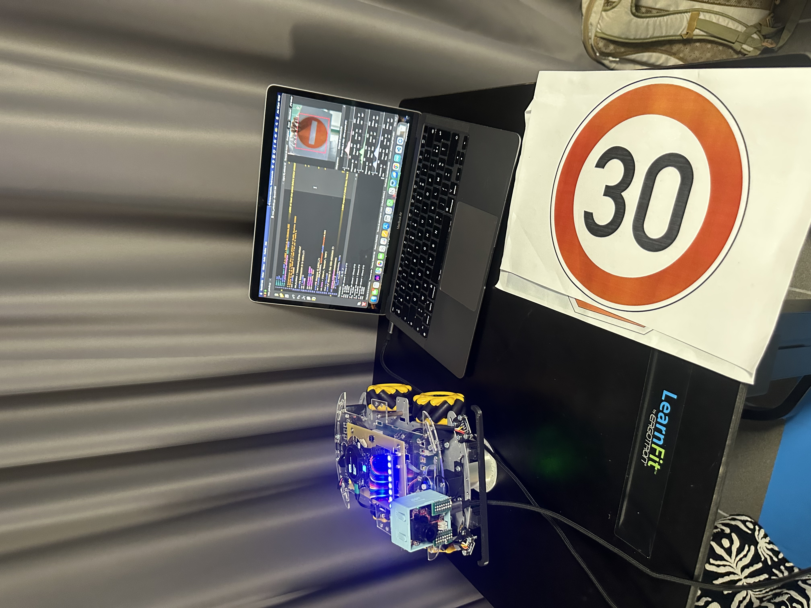

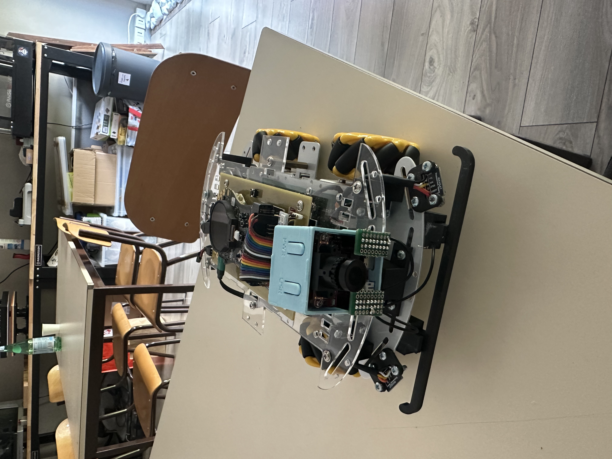
